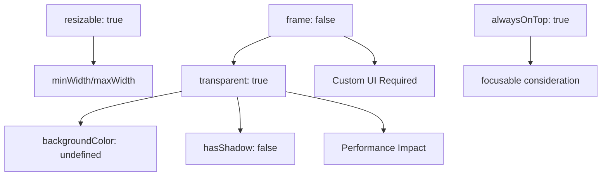

# Window Architecture Configuration Guide for Claude Code

## Purpose

This document provides comprehensive guidance for understanding and modifying FileCataloger's window architecture. It's specifically designed to help Claude Code (and developers) make effective changes to the window system without breaking the application.

## Table of Contents

1. [Architecture Overview](#architecture-overview)
2. [Window Configuration Settings](#window-configuration-settings)
3. [How to Modify Window Behavior](#how-to-modify-window-behavior)
4. [Common Modifications](#common-modifications)
5. [Effects and Dependencies](#effects-and-dependencies)
6. [Testing Changes](#testing-changes)
7. [Troubleshooting](#troubleshooting)
8. [Quick Reference](#quick-reference)

---

## Architecture Overview

### Core Concept: Two-Layer Architecture

```
┌────────────────────────────────────────────────────────────┐
│                    LAYER 1: BrowserWindow                  │
│                       (Invisible Container)                 │
│  Purpose: OS-level window management, positioning, events  │
│  Config: src/main/modules/window/shelf_manager.ts         │
│                                                            │
│  ┌────────────────────────────────────────────────────┐  │
│  │               LAYER 2: React UI                      │  │
│  │                  (Visible Content)                   │  │
│  │  Purpose: Visual presentation, user interaction      │  │
│  │  Config: src/renderer/pages/shelf/ShelfPage.tsx     │  │
│  └────────────────────────────────────────────────────┘  │
└────────────────────────────────────────────────────────────┘
```

### Key Files to Understand

```typescript
// Window Management (Main Process)
src / main / modules / window / shelf_manager.ts; // Primary window configuration
src / main / modules / window / advanced_window_pool.ts; // Window pooling logic
src / main / modules / window / positioning_strategy.ts; // Window positioning

// UI Rendering (Renderer Process)
src / renderer / pages / shelf / ShelfPage.tsx; // Main shelf UI component
src /
  renderer /
  pages /
  shelf /
  components / // UI components
  src /
  renderer /
  stores /
  shelfStore.ts; // State management

// Configuration & Types
src / shared / types / shelf.ts; // Type definitions
src / shared / constants.ts; // Configuration constants
```

---

## Window Configuration Settings

### Complete BrowserWindow Configuration

**Location:** `src/main/modules/window/shelf_manager.ts:232-271`

```typescript
const windowConfig: Electron.BrowserWindowConstructorOptions = {
  // WINDOW FRAME SETTINGS
  frame: false, // Removes OS chrome (title bar, buttons)
  // Effect: Enables custom UI, no standard window controls
  // Change to true: Standard OS window appears

  transparent: true, // Makes window background transparent
  // Effect: Allows see-through to desktop/other windows
  // Change to false: Solid background, better performance

  backgroundColor: undefined, // No background color (enforces transparency)
  // Effect: Complete transparency
  // Change to '#FFFFFF': White background

  hasShadow: false, // Removes OS-level window shadow
  // Effect: Clean floating appearance
  // Change to true: Standard window shadow

  // WINDOW BEHAVIOR
  resizable: false, // Prevents user resizing
  // Effect: Fixed shelf size
  // Change to true: User can resize shelf

  movable: true, // Allows window movement
  // Effect: User can drag window
  // Change to false: Fixed position

  minimizable: false, // Prevents minimizing
  // Effect: Shelf always visible or closed
  // Change to true: Can minimize to dock/taskbar

  maximizable: false, // Prevents maximizing
  // Effect: Shelf stays at set size
  // Change to true: Can fill screen

  closable: true, // Allows closing
  // Effect: User can close shelf
  // Change to false: Permanent window

  focusable: true, // Can receive focus
  // Effect: Can interact with shelf
  // Change to false: Click-through window

  alwaysOnTop: false, // Normal z-order
  // Effect: Shelf can be covered
  // Change to true: Always above other windows

  fullscreenable: false, // Prevents fullscreen
  // Effect: Shelf stays windowed
  // Change to true: Can enter fullscreen

  skipTaskbar: false, // Shows in taskbar
  // Effect: Visible in app switcher
  // Change to true: Hidden from taskbar

  // SIZE AND POSITION
  width: 400, // Initial width in pixels
  // Effect: Default shelf width
  // Range: 200-800 recommended

  height: 300, // Initial height in pixels
  // Effect: Default shelf height
  // Range: 200-600 recommended

  show: false, // Hidden initially
  // Effect: Created invisible, shown when ready
  // Change to true: Visible immediately (may flicker)

  // PLATFORM-SPECIFIC
  titleBarStyle: 'customButtonsOnHover', // macOS title bar style
  // Effect: Custom close/min/max buttons
  // Options: 'hidden', 'hiddenInset', 'default'

  trafficLightPosition: { x: 10, y: 10 }, // macOS button position
  // Effect: Position of red/yellow/green buttons

  vibrancy: 'under-window', // macOS blur effect
  // Effect: Translucent background
  // Options: 'sidebar', 'selection', 'menu', etc.

  // WEB PREFERENCES
  webPreferences: {
    preload: MAIN_WINDOW_PRELOAD_WEBPACK_ENTRY, // Preload script
    contextIsolation: true, // Security: isolated context
    nodeIntegration: false, // Security: no Node in renderer
    sandbox: false, // Allows some native features
    webSecurity: true, // Security: standard web security
  },
};
```

---

## How to Modify Window Behavior

### 1. Changing Window Appearance

#### Make Window Opaque (Non-Transparent)

```typescript
// In shelf_manager.ts:232-239
const windowConfig = {
  frame: false,
  transparent: false, // Changed from true
  backgroundColor: '#FFFFFF', // Added white background
  hasShadow: true, // Changed from false
  // ... rest of config
};

// Effect: Solid white window with shadow
// Use case: Better performance, standard window look
```

#### Add Standard Window Controls

```typescript
// In shelf_manager.ts:232
const windowConfig = {
  frame: true, // Changed from false
  transparent: false, // Must be false with frame
  backgroundColor: '#FFFFFF',
  // ... rest of config
};

// Effect: Standard OS title bar with minimize/maximize/close buttons
// Use case: Traditional window appearance
```

#### Make Window Always on Top

```typescript
// In shelf_manager.ts:249
const windowConfig = {
  // ... other config
  alwaysOnTop: true, // Changed from false
  // ... rest of config
};

// Effect: Shelf floats above all other windows
// Use case: Persistent accessibility tool
```

### 2. Changing Window Size

#### Modify Default Size

```typescript
// In src/shared/constants.ts
export const SHELF_CONSTANTS = {
  DEFAULT_WIDTH: 400,  // Change this value (pixels)
  DEFAULT_HEIGHT: 300, // Change this value (pixels)
  MIN_WIDTH: 200,      // Minimum allowed width
  MAX_WIDTH: 800,      // Maximum allowed width
  MIN_HEIGHT: 150,     // Minimum allowed height
  MAX_HEIGHT: 600,     // Maximum allowed height
};

// Then in shelf_manager.ts:256-257
width: SHELF_CONSTANTS.DEFAULT_WIDTH,
height: SHELF_CONSTANTS.DEFAULT_HEIGHT,
```

#### Enable User Resizing

```typescript
// In shelf_manager.ts:243
const windowConfig = {
  // ... other config
  resizable: true, // Changed from false
  minWidth: 200, // Add minimum width
  minHeight: 150, // Add minimum height
  maxWidth: 800, // Add maximum width
  maxHeight: 600, // Add maximum height
  // ... rest of config
};

// Effect: User can drag window edges to resize
// Note: Must update React UI to handle dynamic sizing
```

### 3. Changing Window Position

#### Modify Initial Position Strategy

```typescript
// In src/main/modules/window/positioning_strategy.ts
export class PositioningStrategy {
  static getInitialPosition(display: Display): Point {
    // Current: Center of screen
    const x = display.bounds.x + (display.bounds.width - 400) / 2;
    const y = display.bounds.y + (display.bounds.height - 300) / 2;

    // Alternative: Top-right corner
    // const x = display.bounds.x + display.bounds.width - 420;
    // const y = display.bounds.y + 20;

    // Alternative: Bottom-center (dock-like)
    // const x = display.bounds.x + (display.bounds.width - 400) / 2;
    // const y = display.bounds.y + display.bounds.height - 320;

    return { x, y };
  }
}
```

### 4. Modifying Window Pooling

#### Adjust Pool Sizes

```typescript
// In src/main/modules/window/advanced_window_pool.ts:15-20
export class AdvancedWindowPool {
  private readonly config = {
    maxPoolSize: 5, // Total windows in pool
    warmPoolSize: 2, // Pre-initialized windows
    coldPoolSize: 3, // Basic windows
    preloadTimeout: 5000, // Init timeout (ms)
    recycleDelay: 100, // Cleanup delay (ms)
  };
}

// Effect on performance:
// More warm windows = Faster shelf creation, higher memory usage
// Fewer warm windows = Slower shelf creation, lower memory usage
```

---

## Common Modifications

### 1. Create a Solid, Resizable Shelf

```typescript
// Goal: Traditional window that users can resize
// File: src/main/modules/window/shelf_manager.ts

const windowConfig = {
  frame: false, // Keep custom UI
  transparent: false, // Solid background
  backgroundColor: '#F5F5F5', // Light gray
  hasShadow: true, // Standard shadow
  resizable: true, // User can resize
  minWidth: 300,
  maxWidth: 600,
  minHeight: 200,
  maxHeight: 500,
  // ... rest unchanged
};

// Additional changes needed:
// 1. Update React UI to handle resize events
// 2. Add resize handle component
// 3. Save size preferences
```

### 2. Create a Minimal Floating Badge

```typescript
// Goal: Small, always-on-top notification badge
// File: src/main/modules/window/shelf_manager.ts

const windowConfig = {
  frame: false,
  transparent: true,
  backgroundColor: undefined,
  hasShadow: false,
  resizable: false,
  width: 150, // Small width
  height: 50, // Small height
  alwaysOnTop: true, // Always visible
  skipTaskbar: true, // Hidden from taskbar
  focusable: false, // Click-through
  // ... rest unchanged
};
```

### 3. Create a Docked Toolbar

```typescript
// Goal: Fixed toolbar at screen edge
// File: src/main/modules/window/shelf_manager.ts

const windowConfig = {
  frame: false,
  transparent: false,
  backgroundColor: '#2C2C2C', // Dark toolbar
  hasShadow: false,
  resizable: false,
  movable: false, // Fixed position
  width: 60, // Narrow toolbar
  height: 400, // Tall toolbar
  alwaysOnTop: true,
  // ... rest unchanged
};

// Position at right edge:
// In positioning_strategy.ts:
const x = display.bounds.x + display.bounds.width - 60;
const y = display.bounds.y + (display.bounds.height - 400) / 2;
```

---

## Effects and Dependencies

### Window Setting Dependencies



### Performance Implications

| Setting                    | Performance Impact | Memory Usage | GPU Usage |
| -------------------------- | ------------------ | ------------ | --------- |
| `transparent: true`        | High               | Medium       | High      |
| `vibrancy: 'under-window'` | High               | Medium       | High      |
| `frame: false`             | Low                | Low          | Low       |
| `hasShadow: true`          | Medium             | Low          | Medium    |
| `alwaysOnTop: true`        | Low                | Low          | Low       |
| Large window size          | Medium             | High         | Medium    |

### Platform-Specific Considerations

#### macOS

- `vibrancy` effects only work on macOS 10.14+
- `titleBarStyle` affects traffic light positions
- Transparency requires GPU acceleration

#### Windows

- `transparent` windows may have performance issues
- `frame: false` requires custom drag regions
- Shadow rendering differs from macOS

#### Linux

- Transparency support varies by compositor
- `vibrancy` has no effect
- Window decorations vary by desktop environment

---

## Testing Changes

### 1. Basic Testing Checklist

```typescript
// After making window configuration changes:

// ✓ Visual appearance
- [ ] Window appears as expected
- [ ] Transparency/opacity correct
- [ ] Shadow rendering correct
- [ ] Size matches configuration

// ✓ Interaction
- [ ] Window can be moved (if movable: true)
- [ ] Window can be resized (if resizable: true)
- [ ] Window stays on top (if alwaysOnTop: true)
- [ ] Focus behavior correct

// ✓ Performance
- [ ] No flickering on show/hide
- [ ] Smooth animations
- [ ] CPU usage reasonable
- [ ] Memory usage stable

// ✓ Cross-platform
- [ ] Test on macOS
- [ ] Test on Windows (if applicable)
- [ ] Test on Linux (if applicable)
```

### 2. Testing Commands

```bash
# Run development mode with live reload
yarn dev

# Check for TypeScript errors
yarn typecheck

# Run specific window tests
yarn test:window

# Monitor performance
# Open DevTools: Cmd+Option+I (Mac) / Ctrl+Shift+I (Win/Linux)
# Go to Performance tab
```

### 3. Debug Helpers

```typescript
// Add to shelf_manager.ts for debugging:
class ShelfManager {
  private debugWindow(window: BrowserWindow): void {
    console.log('Window Config:', {
      size: window.getSize(),
      position: window.getPosition(),
      isVisible: window.isVisible(),
      isTransparent: window.isTransparent(),
      isResizable: window.isResizable(),
      isMovable: window.isMovable(),
      isAlwaysOnTop: window.isAlwaysOnTop(),
    });
  }
}
```

---

## Troubleshooting

### Common Issues and Solutions

#### 1. Window Appears Black/White Instead of Transparent

**Problem:** Setting `transparent: true` but window has solid background

**Solutions:**

```typescript
// Check these settings:
transparent: true,              // Must be true
backgroundColor: undefined,    // Must be undefined or not set
frame: false,                  // Usually needs to be false

// In React component (ShelfPage.tsx):
<div className="bg-transparent"> // Ensure no opaque background
```

#### 2. Window Flickers on Creation

**Problem:** Window briefly appears then repositions

**Solutions:**

```typescript
// In shelf_manager.ts:
show: (false, // Create hidden
  // Then after positioning:
  window.once('ready-to-show', () => {
    window.show(); // Show when ready
  }));
```

#### 3. Cannot Drag Window

**Problem:** `movable: true` but window won't move

**Solutions:**

```typescript
// Define drag region in React (ShelfPage.tsx):
<div
  style={{ WebkitAppRegion: 'drag' }}
  className="h-8 w-full"
>
  {/* Draggable title bar area */}
</div>

// Exclude buttons from drag region:
<button style={{ WebkitAppRegion: 'no-drag' }}>
```

#### 4. Performance Issues with Transparency

**Problem:** High CPU/GPU usage with transparent windows

**Solutions:**

```typescript
// Option 1: Disable transparency
transparent: false,
backgroundColor: '#FFFFFF',

// Option 2: Reduce visual effects
vibrancy: undefined,  // Remove blur
hasShadow: false,     // Remove shadow

// Option 3: Optimize React rendering
// Use React.memo, useMemo, useCallback
```

#### 5. Window Position Wrong on Multi-Monitor

**Problem:** Window appears on wrong monitor

**Solutions:**

```typescript
// In positioning_strategy.ts:
import { screen } from 'electron';

static getInitialPosition(point: Point): Point {
  // Get display at cursor position
  const display = screen.getDisplayNearestPoint(point);

  // Ensure window is within display bounds
  const x = Math.max(
    display.bounds.x,
    Math.min(point.x, display.bounds.x + display.bounds.width - 400)
  );
  const y = Math.max(
    display.bounds.y,
    Math.min(point.y, display.bounds.y + display.bounds.height - 300)
  );

  return { x, y };
}
```

---

## Quick Reference

### Essential Commands for Claude Code

```typescript
// When modifying window appearance:
// 1. Edit: src/main/modules/window/shelf_manager.ts:232-271
// 2. Test: yarn dev
// 3. Check: yarn typecheck

// When modifying window size:
// 1. Edit: src/shared/constants.ts (SHELF_CONSTANTS)
// 2. Update: shelf_manager.ts width/height
// 3. Adjust: React components for new size

// When modifying window behavior:
// 1. Edit: shelf_manager.ts (BrowserWindow config)
// 2. Update: React UI if needed (ShelfPage.tsx)
// 3. Test: Interaction and focus behavior

// When debugging issues:
// 1. Check: Console logs in main process
// 2. Check: DevTools in renderer process
// 3. Use: window.webContents.openDevTools()
```

### Configuration Impact Matrix

| Change               | Affects UI | Affects Performance | Affects UX | Requires React Changes |
| -------------------- | ---------- | ------------------- | ---------- | ---------------------- |
| `frame: true`        | ✓✓✓        | ✓                   | ✓✓✓        | Maybe                  |
| `transparent: false` | ✓✓         | ✓✓✓                 | ✓          | No                     |
| `resizable: true`    | ✓          | ✓                   | ✓✓         | Yes                    |
| `alwaysOnTop: true`  | -          | ✓                   | ✓✓✓        | No                     |
| Window size          | ✓✓         | ✓                   | ✓✓         | Yes                    |
| `vibrancy`           | ✓✓         | ✓✓✓                 | ✓          | No                     |

### Do's and Don'ts for Claude Code

**DO:**

- ✅ Test changes with `yarn dev` immediately
- ✅ Keep `frame: false` for floating shelf design
- ✅ Maintain transparent background for shelf metaphor
- ✅ Test on actual drag-drop operations
- ✅ Check memory usage after pooling changes
- ✅ Preserve the two-layer architecture

**DON'T:**

- ❌ Mix `frame: true` with `transparent: true`
- ❌ Set large pool sizes (>10 windows)
- ❌ Remove security settings in webPreferences
- ❌ Ignore platform-specific settings
- ❌ Change window type without updating React UI
- ❌ Modify positioning without multi-monitor testing

---

## Summary

The window architecture uses invisible Electron windows as containers for visible React UI. This enables:

1. Complete control over appearance
2. Fast window creation via pooling
3. Modern, frameless design
4. Cross-platform consistency

When modifying:

1. Understand the two-layer architecture
2. Test changes immediately with `yarn dev`
3. Consider platform differences
4. Update both Electron and React layers as needed
5. Monitor performance impacts

This guide should enable Claude Code to make informed modifications to the window system while maintaining application stability and performance.
