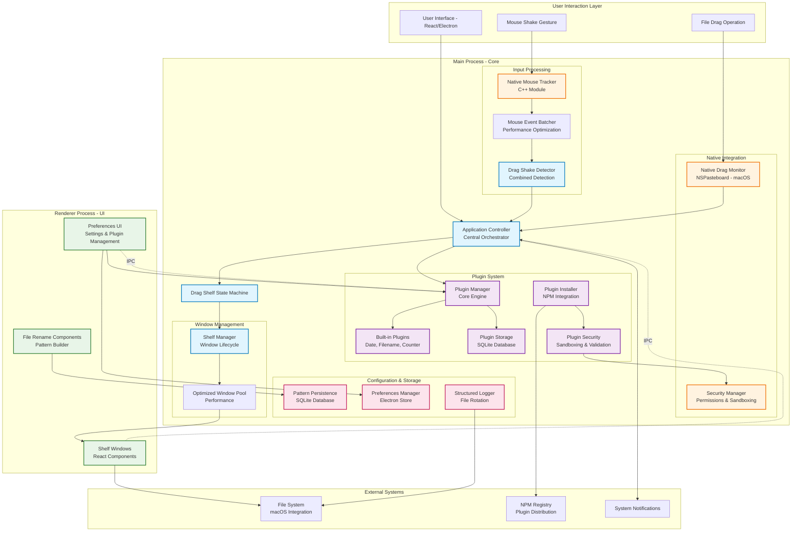
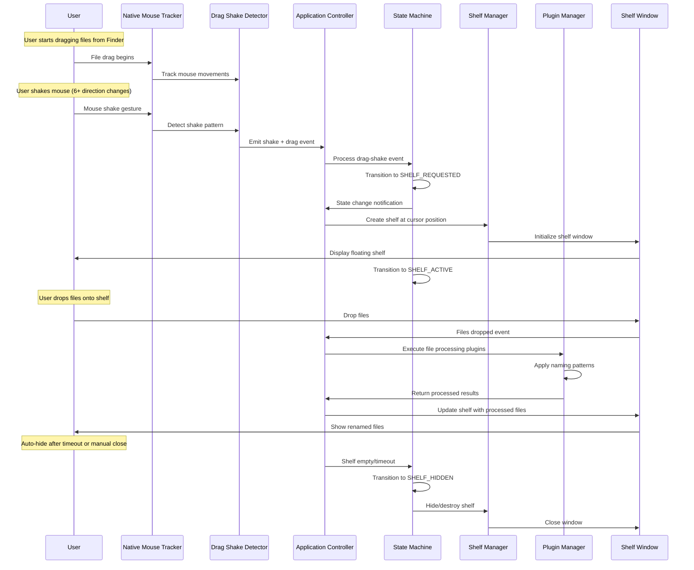
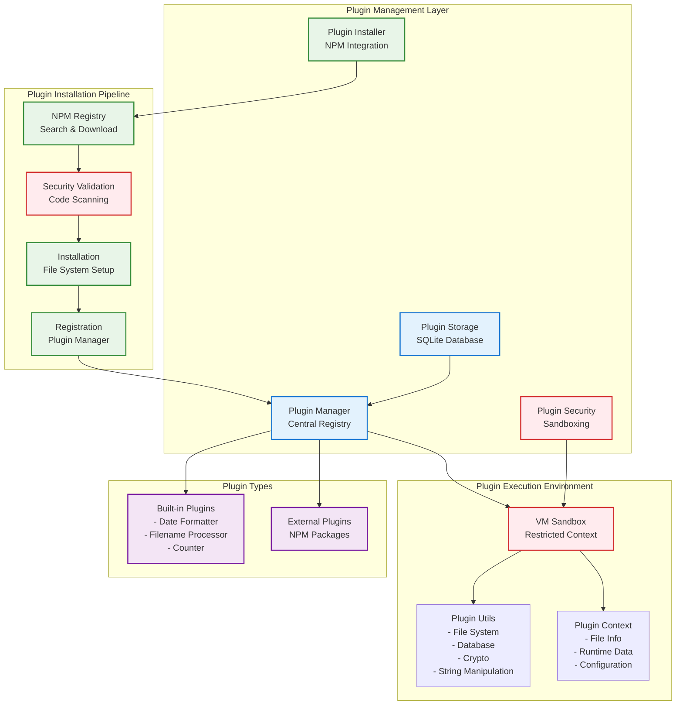
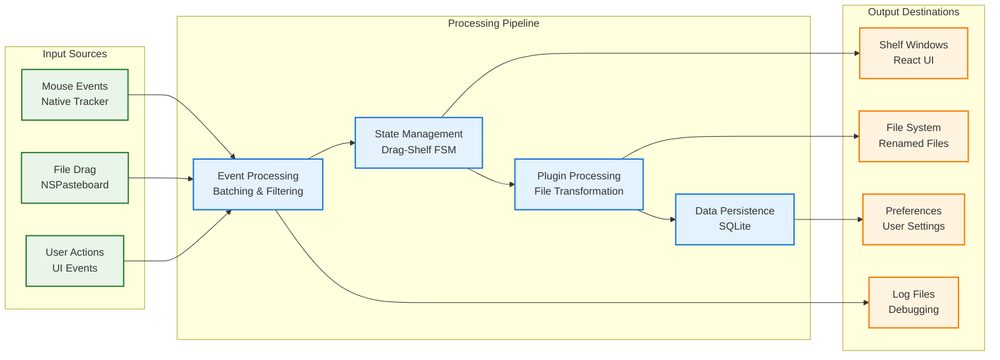

# FileCataloger High-Level Workflow Diagram

## System Architecture Overview

```mermaid
graph TB
    subgraph "User Interaction Layer"
        UI[User Interface - React/Electron]
        Gesture[Mouse Shake Gesture]
        Drag[File Drag Operation]
    end

    subgraph "Main Process - Core"
        AppController[Application Controller<br/>Central Orchestrator]
        StateM[Drag Shelf State Machine]

        subgraph "Input Processing"
            MouseTracker[Native Mouse Tracker<br/>C++ Module]
            DragShake[Drag Shake Detector<br/>Combined Detection]
            EventBatcher[Mouse Event Batcher<br/>Performance Optimization]
        end

        subgraph "Window Management"
            ShelfManager[Shelf Manager<br/>Window Lifecycle]
            WindowPool[Optimized Window Pool<br/>Performance]
        end

        subgraph "Plugin System"
            PluginManager[Plugin Manager<br/>Core Engine]
            PluginInstaller[Plugin Installer<br/>NPM Integration]
            PluginSecurity[Plugin Security<br/>Sandboxing & Validation]
            PluginStorage[Plugin Storage<br/>SQLite Database]
            BuiltinPlugins[Built-in Plugins<br/>Date, Filename, Counter]
        end

        subgraph "Configuration & Storage"
            PrefsManager[Preferences Manager<br/>Electron Store]
            PatternStorage[Pattern Persistence<br/>SQLite Database]
            Logger[Structured Logger<br/>File Rotation]
        end

        subgraph "Native Integration"
            NativeDrag[Native Drag Monitor<br/>NSPasteboard - macOS]
            Security[Security Manager<br/>Permissions & Sandboxing]
        end
    end

    subgraph "Renderer Process - UI"
        ShelfUI[Shelf Windows<br/>React Components]
        PrefsUI[Preferences UI<br/>Settings & Plugin Management]
        FileRename[File Rename Components<br/>Pattern Builder]
    end

    subgraph "External Systems"
        NPMRegistry[NPM Registry<br/>Plugin Distribution]
        FileSystem[File System<br/>macOS Integration]
        Notifications[System Notifications]
    end

    %% Core workflow connections
    Gesture --> MouseTracker
    Drag --> NativeDrag
    MouseTracker --> EventBatcher
    EventBatcher --> DragShake
    DragShake --> AppController
    NativeDrag --> AppController

    AppController --> StateM
    StateM --> ShelfManager
    ShelfManager --> WindowPool
    WindowPool --> ShelfUI

    %% Plugin system workflow
    AppController --> PluginManager
    PluginManager --> BuiltinPlugins
    PluginManager --> PluginStorage
    PluginInstaller --> NPMRegistry
    PluginInstaller --> PluginSecurity
    PluginSecurity --> Security

    %% UI interactions
    UI --> AppController
    PrefsUI --> PrefsManager
    PrefsUI --> PluginManager
    FileRename --> PatternStorage

    %% External integrations
    ShelfUI --> FileSystem
    AppController --> Notifications
    Logger --> FileSystem

    %% IPC Communication
    ShelfUI -.->|IPC| AppController
    PrefsUI -.->|IPC| PluginManager

    classDef coreModule fill:#e1f5fe,stroke:#0277bd,stroke-width:2px
    classDef pluginModule fill:#f3e5f5,stroke:#7b1fa2,stroke-width:2px
    classDef uiModule fill:#e8f5e8,stroke:#2e7d32,stroke-width:2px
    classDef nativeModule fill:#fff3e0,stroke:#ef6c00,stroke-width:2px
    classDef storageModule fill:#fce4ec,stroke:#c2185b,stroke-width:2px

    class AppController,StateM,DragShake,ShelfManager coreModule
    class PluginManager,PluginInstaller,PluginSecurity,PluginStorage,BuiltinPlugins pluginModule
    class ShelfUI,PrefsUI,FileRename uiModule
    class MouseTracker,NativeDrag,Security nativeModule
    class PrefsManager,PatternStorage,Logger storageModule
```

## Core Workflow Sequence

```mermaid
sequenceDiagram
    participant User
    participant MouseTracker as Native Mouse Tracker
    participant DragShake as Drag Shake Detector
    participant AppController as Application Controller
    participant StateMachine as State Machine
    participant ShelfManager as Shelf Manager
    participant PluginManager as Plugin Manager
    participant ShelfUI as Shelf Window

    Note over User: User starts dragging files from Finder
    User->>MouseTracker: File drag begins
    MouseTracker->>DragShake: Track mouse movements

    Note over User: User shakes mouse (6+ direction changes)
    User->>MouseTracker: Mouse shake gesture
    MouseTracker->>DragShake: Detect shake pattern
    DragShake->>AppController: Emit shake + drag event

    AppController->>StateMachine: Process drag-shake event
    StateMachine->>StateMachine: Transition to SHELF_REQUESTED
    StateMachine->>AppController: State change notification

    AppController->>ShelfManager: Create shelf at cursor position
    ShelfManager->>ShelfUI: Initialize shelf window
    ShelfUI->>User: Display floating shelf

    StateMachine->>StateMachine: Transition to SHELF_ACTIVE

    Note over User: User drops files onto shelf
    User->>ShelfUI: Drop files
    ShelfUI->>AppController: Files dropped event
    AppController->>PluginManager: Execute file processing plugins
    PluginManager->>PluginManager: Apply naming patterns
    PluginManager->>AppController: Return processed results

    AppController->>ShelfUI: Update shelf with processed files
    ShelfUI->>User: Show renamed files

    Note over User: Auto-hide after timeout or manual close
    AppController->>StateMachine: Shelf empty/timeout
    StateMachine->>StateMachine: Transition to SHELF_HIDDEN
    StateMachine->>ShelfManager: Hide/destroy shelf
    ShelfManager->>ShelfUI: Close window
```

## Plugin System Architecture

```mermaid
graph TB
    subgraph "Plugin Management Layer"
        PM[Plugin Manager<br/>Central Registry]
        PI[Plugin Installer<br/>NPM Integration]
        PS[Plugin Storage<br/>SQLite Database]
        PSec[Plugin Security<br/>Sandboxing]
    end

    subgraph "Plugin Types"
        BP[Built-in Plugins<br/>- Date Formatter<br/>- Filename Processor<br/>- Counter]
        EP[External Plugins<br/>NPM Packages]
    end

    subgraph "Plugin Execution Environment"
        Sandbox[VM Sandbox<br/>Restricted Context]
        Utils[Plugin Utils<br/>- File System<br/>- Database<br/>- Crypto<br/>- String Manipulation]
        Context[Plugin Context<br/>- File Info<br/>- Runtime Data<br/>- Configuration]
    end

    subgraph "Plugin Installation Pipeline"
        NPM[NPM Registry<br/>Search & Download]
        Validate[Security Validation<br/>Code Scanning]
        Install[Installation<br/>File System Setup]
        Register[Registration<br/>Plugin Manager]
    end

    PM --> BP
    PM --> EP
    PI --> NPM
    NPM --> Validate
    Validate --> Install
    Install --> Register
    Register --> PM

    PM --> Sandbox
    Sandbox --> Utils
    Sandbox --> Context
    PS --> PM
    PSec --> Sandbox

    classDef core fill:#e3f2fd,stroke:#1976d2,stroke-width:2px
    classDef plugin fill:#f3e5f5,stroke:#7b1fa2,stroke-width:2px
    classDef security fill:#ffebee,stroke:#d32f2f,stroke-width:2px
    classDef install fill:#e8f5e8,stroke:#388e3c,stroke-width:2px

    class PM,PS core
    class BP,EP plugin
    class PSec,Sandbox,Validate security
    class PI,NPM,Install,Register install
```

## Data Flow Architecture

```mermaid
graph LR
    subgraph "Input Sources"
        Mouse[Mouse Events<br/>Native Tracker]
        Files[File Drag<br/>NSPasteboard]
        User[User Actions<br/>UI Events]
    end

    subgraph "Processing Pipeline"
        Event[Event Processing<br/>Batching & Filtering]
        State[State Management<br/>Drag-Shelf FSM]
        Plugin[Plugin Processing<br/>File Transformation]
        Storage[Data Persistence<br/>SQLite]
    end

    subgraph "Output Destinations"
        Windows[Shelf Windows<br/>React UI]
        FS[File System<br/>Renamed Files]
        Prefs[Preferences<br/>User Settings]
        Logs[Log Files<br/>Debugging]
    end

    Mouse --> Event
    Files --> Event
    User --> Event

    Event --> State
    State --> Plugin
    Plugin --> Storage

    State --> Windows
    Plugin --> FS
    Storage --> Prefs
    Event --> Logs

    classDef input fill:#e8f5e8,stroke:#2e7d32,stroke-width:2px
    classDef processing fill:#e3f2fd,stroke:#1976d2,stroke-width:2px
    classDef output fill:#fff3e0,stroke:#f57c00,stroke-width:2px

    class Mouse,Files,User input
    class Event,State,Plugin,Storage processing
    class Windows,FS,Prefs,Logs output
```