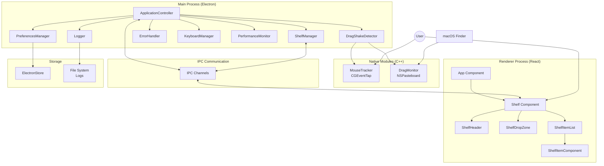
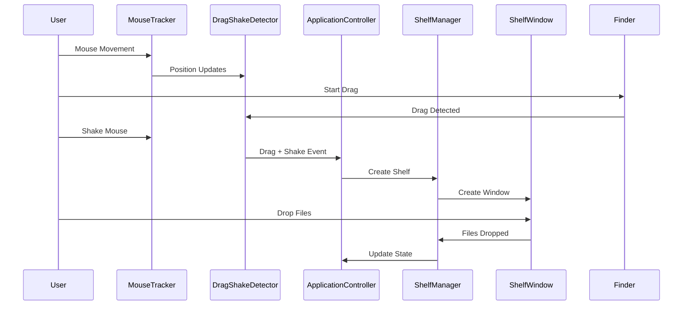

# FileCataloger Architecture Diagram

## System Overview

## Data Flow Diagram

## Component Responsibilities

### Main Process Components

1. **ApplicationController**
   - Central orchestrator
   - Coordinates all modules
   - Manages shelf lifecycle
   - Handles drag/shake events

2. **ShelfManager**
   - Creates/destroys shelf windows
   - Manages shelf configurations
   - Window pooling for performance
   - Docking positions management

3. **DragShakeDetector**
   - Combines drag and shake detection
   - Processes mouse position updates
   - Emits drag-shake events

4. **PreferencesManager**
   - User settings persistence
   - Uses ElectronStore
   - Singleton pattern

5. **ErrorHandler**
   - Multi-level error system
   - Error categorization
   - Fallback mechanisms

6. **PerformanceMonitor**
   - CPU/Memory tracking
   - Auto-cleanup on high usage
   - Performance warnings

### Native Modules

1. **MouseTracker (Darwin)**
   - CGEventTap-based tracking
   - Real-time mouse position
   - Button state tracking
   - Fallback to Node.js implementation

2. **DragMonitor**
   - NSPasteboard monitoring
   - Drag operation detection
   - File path extraction

### Renderer Components

1. **Shelf Component**
   - Main shelf UI container
   - Drag & drop handling
   - Dynamic height adjustment
   - Item management

2. **ShelfDropZone**
   - File drop handling
   - Visual feedback
   - File validation

3. **ShelfItemList**
   - Virtualized list for performance
   - Item rendering
   - Scroll management

## Key Design Patterns

1. **Singleton Pattern**
   - PreferencesManager
   - ErrorHandler

2. **Event-Driven Architecture**
   - EventEmitter for module communication
   - IPC for process communication

3. **Compound Components**
   - Shelf with sub-components
   - Separation of concerns

4. **Window Pooling**
   - Performance optimization
   - Reusable shelf windows

5. **Fallback Mechanisms**
   - Native module failures
   - Graceful degradation
