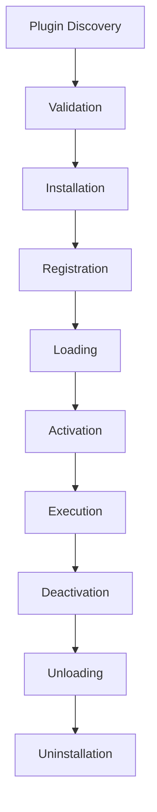
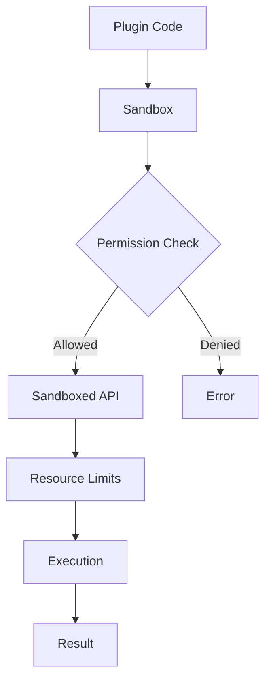

# Stage 3: Plugin Architecture Core

**Timeline**: Weeks 3-4
**Priority**: HIGH
**Dependencies**: Stage 2 completion

## Overview
This stage implements the core plugin system architecture, including the plugin manager, sandbox environment, and API layer. This is the foundation that enables third-party developers to create custom naming components.

## Week 1 Tasks

### Day 1-2: Plugin Interface Design

#### Core Interfaces
- [ ] **Create Plugin Type Definitions**
  ```typescript
  // src/shared/types/plugins.ts

  export interface NamingPlugin {
    // Metadata
    id: string;
    name: string;
    version: string;
    author: PluginAuthor;
    description: string;
    icon?: string;
    homepage?: string;
    repository?: string;
    license?: string;

    // Technical details
    type: 'component';
    engine: PluginEngine;
    capabilities: PluginCapability[];
    permissions: PluginPermission[];
    dependencies?: PluginDependency[];

    // Component specific
    component: ComponentDefinition;

    // Lifecycle hooks
    lifecycle?: PluginLifecycle;

    // Configuration
    configSchema?: JSONSchema7;
    defaultConfig?: Record<string, any>;
  }

  export interface PluginAuthor {
    name: string;
    email?: string;
    url?: string;
  }

  export interface PluginEngine {
    filecataloger: string;  // ">=2.0.0"
    node?: string;          // ">=16.0.0"
    electron?: string;      // ">=28.0.0"
  }

  export enum PluginCapability {
    FILE_SYSTEM_READ = 'file_system_read',
    FILE_SYSTEM_WRITE = 'file_system_write',
    NETWORK_ACCESS = 'network_access',
    DATABASE_ACCESS = 'database_access',
    EXTERNAL_PROCESS = 'external_process',
    SYSTEM_INFO = 'system_info',
    CLIPBOARD = 'clipboard',
  }

  export interface ComponentDefinition {
    // Main render function
    render: string; // Function as string to be executed in sandbox

    // Optional batch processing
    renderBatch?: string;

    // Component UI configuration
    configComponent?: string;

    // Preview function for UI
    preview?: string;

    // Validation function
    validate?: string;
  }

  export interface PluginLifecycle {
    onInstall?: string;
    onUninstall?: string;
    onActivate?: string;
    onDeactivate?: string;
    onUpdate?: string;
  }
  ```

#### Plugin Context
- [ ] **Define Plugin Context Interface**
  ```typescript
  export interface PluginContext {
    // Current file information
    file: PluginFileInfo;

    // User configuration for this instance
    config: Record<string, any>;

    // Utility functions (sandboxed)
    utils: PluginUtils;

    // Runtime information
    runtime: PluginRuntime;

    // Storage access (sandboxed)
    storage: PluginStorage;

    // Event system
    events: PluginEventEmitter;

    // Logger
    logger: PluginLogger;
  }

  export interface PluginFileInfo {
    path: string;
    name: string;
    nameWithoutExtension: string;
    extension: string;
    size: number;
    type: string;
    created: number; // timestamp
    modified: number;
    accessed: number;
    isDirectory: boolean;
    isHidden: boolean;
    metadata?: Record<string, any>;
  }

  export interface PluginRuntime {
    index: number;
    total: number;
    timestamp: number;
    locale: string;
    platform: NodeJS.Platform;
    isDarkMode: boolean;
    appVersion: string;
  }
  ```

### Day 3-4: Plugin Manager Implementation

#### Core Plugin Manager
- [ ] **Create PluginManager Class**
  ```typescript
  // src/main/modules/plugins/pluginManager.ts

  export class PluginManager extends EventEmitter {
    private plugins: Map<string, LoadedPlugin>;
    private registry: PluginRegistry;
    private sandbox: PluginSandbox;
    private validator: PluginValidator;
    private cache: PluginCache;

    // Discovery
    async discoverPlugins(): Promise<DiscoveredPlugin[]>;
    async scanDirectory(dir: string): Promise<DiscoveredPlugin[]>;
    async validatePlugin(path: string): Promise<ValidationResult>;

    // Installation
    async installPlugin(source: string | PluginPackage): Promise<string>;
    async uninstallPlugin(id: string): Promise<void>;
    async updatePlugin(id: string, version?: string): Promise<void>;

    // Lifecycle
    async loadPlugin(id: string): Promise<LoadedPlugin>;
    async unloadPlugin(id: string): Promise<void>;
    async activatePlugin(id: string): Promise<void>;
    async deactivatePlugin(id: string): Promise<void>;

    // Execution
    async executePlugin(
      id: string,
      method: string,
      context: PluginContext
    ): Promise<any>;

    // Query
    getPlugin(id: string): LoadedPlugin | undefined;
    getPlugins(filter?: PluginFilter): LoadedPlugin[];
    isPluginLoaded(id: string): boolean;
    isPluginActive(id: string): boolean;

    // Configuration
    async configurePlugin(id: string, config: any): Promise<void>;
    async getPluginConfig(id: string): Promise<any>;

    // Permissions
    async requestPermissions(
      id: string,
      permissions: PluginPermission[]
    ): Promise<boolean>;
    async revokePermissions(
      id: string,
      permissions: PluginPermission[]
    ): Promise<void>;
  }
  ```

#### Plugin Registry
- [ ] **Implement Plugin Registry**
  ```typescript
  // src/main/modules/plugins/pluginRegistry.ts

  export class PluginRegistry {
    private db: Database;
    private cache: Map<string, PluginMetadata>;

    // Registration
    async register(plugin: NamingPlugin, path: string): Promise<void>;
    async unregister(id: string): Promise<void>;
    async update(id: string, updates: Partial<PluginMetadata>): Promise<void>;

    // Queries
    async getById(id: string): Promise<PluginMetadata | null>;
    async getByPath(path: string): Promise<PluginMetadata | null>;
    async search(query: PluginQuery): Promise<PluginMetadata[]>;
    async getAll(): Promise<PluginMetadata[]>;

    // Dependencies
    async resolveDependencies(plugin: NamingPlugin): Promise<DependencyTree>;
    async checkCompatibility(plugin: NamingPlugin): Promise<CompatibilityResult>;

    // Integrity
    async verifyIntegrity(id: string): Promise<IntegrityResult>;
    async updateChecksum(id: string, checksum: string): Promise<void>;
  }
  ```

#### Plugin Loader
- [ ] **Create Plugin Loader**
  ```typescript
  // src/main/modules/plugins/pluginLoader.ts

  export class PluginLoader {
    private loadedModules: Map<string, any>;

    // Load plugin module
    async loadModule(path: string): Promise<any>;

    // Validate plugin structure
    validateStructure(module: any): boolean;

    // Extract plugin definition
    extractPlugin(module: any): NamingPlugin;

    // Load dependencies
    async loadDependencies(plugin: NamingPlugin): Promise<void>;

    // Unload module
    async unloadModule(id: string): Promise<void>;

    // Hot reload support
    async reloadModule(id: string): Promise<void>;
  }
  ```

### Day 5: Plugin Sandbox (Week 1)

#### Research Sandboxing Options
- [ ] **Evaluate Sandboxing Solutions**
  - VM2 library evaluation
  - Node.js vm module
  - Isolated Web Workers
  - WebAssembly sandbox
  - Process isolation

- [ ] **Security Requirements**
  - Code execution isolation
  - Resource access control
  - Memory limits
  - CPU time limits
  - Network restrictions

#### Basic Sandbox Implementation
- [ ] **Create PluginSandbox Class**
  ```typescript
  // src/main/modules/plugins/pluginSandbox.ts

  export class PluginSandbox {
    private vm: VM;
    private contexts: Map<string, SandboxContext>;

    // Create sandbox for plugin
    async createSandbox(plugin: NamingPlugin): Promise<SandboxContext>;

    // Execute code in sandbox
    async execute(
      pluginId: string,
      code: string,
      context: PluginContext,
      timeout?: number
    ): Promise<any>;

    // Permission checks
    checkPermission(
      pluginId: string,
      capability: PluginCapability
    ): boolean;

    // Resource management
    setResourceLimits(pluginId: string, limits: ResourceLimits): void;
    getResourceUsage(pluginId: string): ResourceUsage;

    // Cleanup
    destroySandbox(pluginId: string): void;

    // Error handling
    handleSandboxError(error: any): SandboxError;
  }

  interface ResourceLimits {
    memory: number;      // MB
    cpuTime: number;     // ms
    fileHandles: number;
    networkRequests: number;
  }
  ```

## Week 2 Tasks

### Day 1-2: Plugin API Implementation

#### Core APIs
- [ ] **Implement Plugin Utils**
  ```typescript
  // src/main/modules/plugins/api/pluginUtils.ts

  export class PluginUtils {
    // File system utilities (restricted)
    fs: {
      readFile: (path: string) => Promise<Buffer>;
      exists: (path: string) => Promise<boolean>;
      getStats: (path: string) => Promise<FileStats>;
      readDir: (path: string) => Promise<string[]>;
    };

    // Formatting utilities
    format: {
      date: (date: Date | number, format: string) => string;
      number: (num: number, format: string) => string;
      bytes: (bytes: number, precision?: number) => string;
      duration: (ms: number, format?: string) => string;
      currency: (amount: number, currency: string) => string;
    };

    // String manipulation
    string: {
      slugify: (text: string) => string;
      camelCase: (text: string) => string;
      pascalCase: (text: string) => string;
      kebabCase: (text: string) => string;
      snakeCase: (text: string) => string;
      titleCase: (text: string) => string;
      truncate: (text: string, length: number) => string;
      padStart: (text: string, length: number, char?: string) => string;
      padEnd: (text: string, length: number, char?: string) => string;
    };

    // Crypto utilities
    crypto: {
      md5: (data: string | Buffer) => string;
      sha1: (data: string | Buffer) => string;
      sha256: (data: string | Buffer) => string;
      uuid: () => string;
      randomString: (length: number) => string;
    };

    // Data utilities
    data: {
      parse: {
        json: (text: string) => any;
        yaml: (text: string) => any;
        csv: (text: string) => any[];
        xml: (text: string) => any;
      };
      stringify: {
        json: (data: any, pretty?: boolean) => string;
        yaml: (data: any) => string;
        csv: (data: any[]) => string;
        xml: (data: any) => string;
      };
    };
  }
  ```

#### Storage API
- [ ] **Implement Plugin Storage**
  ```typescript
  // src/main/modules/plugins/api/pluginStorage.ts

  export class PluginStorageAPI {
    private pluginId: string;
    private quotas: StorageQuotas;

    // Local storage (per-plugin)
    local: {
      get: (key: string) => Promise<any>;
      set: (key: string, value: any) => Promise<void>;
      delete: (key: string) => Promise<void>;
      clear: () => Promise<void>;
      keys: () => Promise<string[]>;
      size: () => Promise<number>;
    };

    // User storage (synced)
    user: {
      get: (key: string) => Promise<any>;
      set: (key: string, value: any) => Promise<void>;
      delete: (key: string) => Promise<void>;
      keys: () => Promise<string[]>;
    };

    // Session storage
    session: {
      get: (key: string) => any;
      set: (key: string, value: any) => void;
      delete: (key: string) => void;
      clear: () => void;
    };

    // Check quotas
    checkQuota(size: number): boolean;
    getUsage(): StorageUsage;
  }
  ```

#### Network API (Optional)
- [ ] **Implement Network API**
  ```typescript
  // src/main/modules/plugins/api/pluginNetwork.ts

  export class PluginNetworkAPI {
    private pluginId: string;
    private rateLimiter: RateLimiter;

    // HTTP client
    http: {
      get: (url: string, options?: RequestOptions) => Promise<Response>;
      post: (url: string, data: any, options?: RequestOptions) => Promise<Response>;
      put: (url: string, data: any, options?: RequestOptions) => Promise<Response>;
      delete: (url: string, options?: RequestOptions) => Promise<Response>;
    };

    // WebSocket support
    ws: {
      connect: (url: string, options?: WebSocketOptions) => Promise<WebSocket>;
      close: (socket: WebSocket) => Promise<void>;
    };

    // Rate limiting
    checkRateLimit(): boolean;
    getRateLimitStatus(): RateLimitStatus;
  }
  ```

### Day 3-4: Permission System

#### Permission Manager
- [ ] **Create Permission Manager**
  ```typescript
  // src/main/modules/plugins/permissionManager.ts

  export class PermissionManager {
    private permissions: Map<string, Set<PluginPermission>>;
    private db: Database;

    // Request permissions
    async requestPermissions(
      pluginId: string,
      permissions: PluginPermission[],
      reason?: string
    ): Promise<PermissionResult>;

    // Check permissions
    hasPermission(
      pluginId: string,
      permission: PluginPermission
    ): boolean;

    hasAllPermissions(
      pluginId: string,
      permissions: PluginPermission[]
    ): boolean;

    // Grant/Revoke
    async grantPermissions(
      pluginId: string,
      permissions: PluginPermission[]
    ): Promise<void>;

    async revokePermissions(
      pluginId: string,
      permissions: PluginPermission[]
    ): Promise<void>;

    // Persistence
    async savePermissions(): Promise<void>;
    async loadPermissions(): Promise<void>;

    // UI helpers
    async showPermissionDialog(
      plugin: NamingPlugin,
      requested: PluginPermission[]
    ): Promise<boolean>;
  }
  ```

#### Permission UI
- [ ] **Create Permission Dialog**
  ```typescript
  // src/renderer/components/PermissionDialog/PermissionDialog.tsx

  interface PermissionDialogProps {
    plugin: NamingPlugin;
    requestedPermissions: PluginPermission[];
    onApprove: () => void;
    onDeny: () => void;
  }

  export const PermissionDialog: React.FC<PermissionDialogProps> = ({
    plugin,
    requestedPermissions,
    onApprove,
    onDeny,
  }) => {
    // Show plugin info
    // List requested permissions with explanations
    // Allow/Deny buttons
    // Remember choice option
  };
  ```

### Day 5: Error Handling and Logging

#### Error System
- [ ] **Create Plugin Error Classes**
  ```typescript
  // src/main/modules/plugins/errors.ts

  export class PluginError extends Error {
    constructor(
      public pluginId: string,
      public code: string,
      message: string,
      public details?: any
    ) {
      super(message);
    }
  }

  export class PluginLoadError extends PluginError {}
  export class PluginExecutionError extends PluginError {}
  export class PluginPermissionError extends PluginError {}
  export class PluginValidationError extends PluginError {}
  export class PluginSandboxError extends PluginError {}
  export class PluginTimeoutError extends PluginError {}
  ```

#### Logging System
- [ ] **Implement Plugin Logger**
  ```typescript
  // src/main/modules/plugins/pluginLogger.ts

  export class PluginLogger {
    private pluginId: string;
    private logFile: string;
    private maxSize: number;

    // Log levels
    debug(message: string, data?: any): void;
    info(message: string, data?: any): void;
    warn(message: string, data?: any): void;
    error(message: string, error?: any): void;

    // Performance logging
    time(label: string): void;
    timeEnd(label: string): void;

    // Query logs
    getLogs(filter?: LogFilter): Promise<LogEntry[]>;
    clearLogs(): Promise<void>;

    // Export logs
    exportLogs(): Promise<string>;
  }
  ```

## Testing Strategy

### Unit Tests
- [ ] Plugin Manager tests
- [ ] Plugin Registry tests
- [ ] Plugin Loader tests
- [ ] Sandbox tests
- [ ] Permission tests
- [ ] API tests

### Integration Tests
- [ ] Plugin installation flow
- [ ] Plugin execution flow
- [ ] Permission request flow
- [ ] Error handling flow
- [ ] Resource cleanup

### Security Tests
- [ ] Sandbox escape attempts
- [ ] Resource exhaustion
- [ ] Permission bypass
- [ ] Code injection
- [ ] Path traversal

### Performance Tests
- [ ] Plugin load time
- [ ] Execution overhead
- [ ] Memory usage
- [ ] Concurrent execution
- [ ] Cache effectiveness

## Architecture Documentation

### Plugin Lifecycle


### Security Model


## Deliverables

1. **Plugin Manager System**
   - Core manager implementation
   - Registry with database
   - Loader with validation

2. **Sandbox Environment**
   - Secure code execution
   - Resource management
   - Permission system

3. **Plugin APIs**
   - Utility functions
   - Storage access
   - Event system

4. **Error Handling**
   - Comprehensive error types
   - Logging system
   - Recovery mechanisms

## Success Criteria

- [ ] Plugins can be installed/uninstalled
- [ ] Sandbox prevents malicious code
- [ ] Permissions are enforced
- [ ] Resource limits work
- [ ] No performance degradation
- [ ] All security tests pass

## Next Stage

Stage 4 will migrate existing components to the plugin system and create new built-in plugins that demonstrate the system's capabilities.